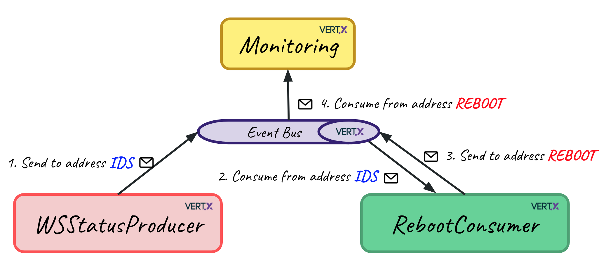

# Clustered Vert.x

## Dummy application

#### WebServiceStatusProducer

Produces randomly [0,1,2] values every 1000 milliseconds and sends them to the event bus "ids" address.

#### RebootConsumer

Consumes the messages from the event bus "ids" address, and launches a "reboot" that lasts for 3000 milliseconds whenever the value is 0. If a reboot is already happening, we don’t need to relaunch any new reboot. When a reboot starts or ends, a message is sent to the event bus to the "reboot" address.

#### Monitoring

Consumes monitoring messages from the event bus "reboot" address and logs them.

## Running the application in cluster mode from your IDE

* Run WebServiceStatusProducer main `producer.WebServiceStatusProducer`
* Run Monitoring main `cosumer.Monitoring`
* Run RebootConsumer main `consumer.RebootConsumer`

You can run multiple RebootConsumers, and you will see how using the ClusteredLock, reboots don't overlap.

## Running from command line

`mvn clean package`

`java -jar target/clustered-1.0-SNAPSHOT-fat.jar run producer.WebServiceStatusProducer -cluster`

`java -jar target/clustered-1.0-SNAPSHOT-fat.jar run consumer.Monitoring -cluster`

`java -jar target/clustered-1.0-SNAPSHOT-fat.jar run consumer.RebootConsumer -cluster`

